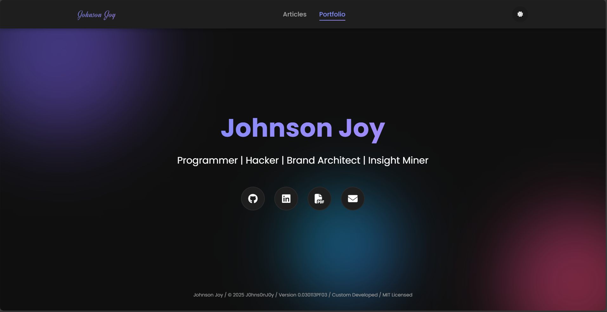
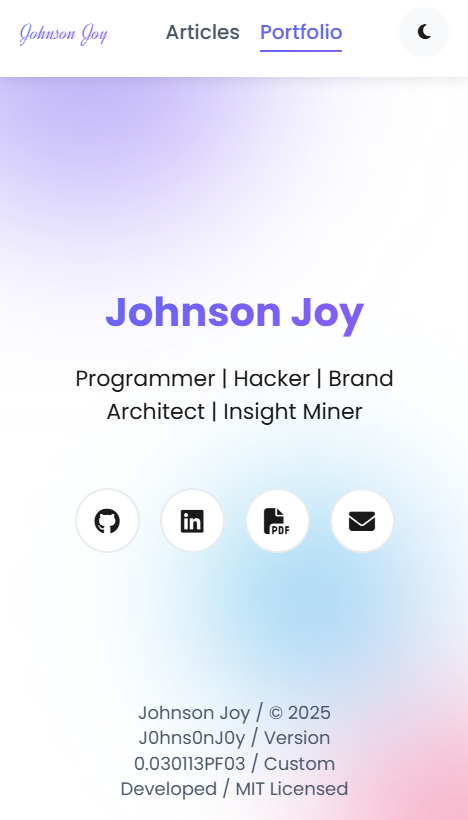

<div align="center">
  
  <h1>johnsonjoy.vercel.app - v3</h1>
</div>

Finally Version 3 of [johnsonjoy.vercel.app](https://johnsonjoy.vercel.app) built with [React](https://react.dev).

| Desktop preview                                                     | Mobile preview                                                    |
| ------------------------------------------------------------------- | ----------------------------------------------------------------- |
|  |  |


This website is designed to be simple and accessible. Dynamic design create an interactive experience for visitors. The site offers two themes via a toggle: a dark theme (default) and a light theme. The selected theme persists across tabs, windows, and page reloads.

## Open source

This website is open source with the hope that others will use the code to create their own websites. If you do, please give proper credit by linking back to [J0hns0nJ0y](https://johnsonjoy.vercel.app).

## Getting started

> [!IMPORTANT]
> This project requires [Node.js](https://nodejs.org/) to run.

1. Clone this repository:
   ```sh
   git clone https://github.com/J0hns0nJ0y/J0hns0nJ0y-Portfolio.git
   ```
2. Navigate into the project directory:
   ```sh
   cd J0hns0nJ0y-Portfolio
   ```
> [!IMPORTANT]
> You may start editing after cloning the project. The next steps are for the "Undermaintenance" folder.

3. Navigate into the undermaintenance folder:
   ```sh
   cd undermaintenance
   ```
4. Install dependencies:
   ```sh
   npm install
   ```
5. Start the app in development mode:
   ```sh
   npm start
   ```
    or
    ```sh
   npm run dev
   ```
<details>
    <summary> Bonus - Undermaintenance folder </summary>
You will find another folder "undermaintenance". This can be editted as 404 page or used as default.

To make this visible:
1. Follow the cloning process
2. Shift the website or main branch files to "backup" folder
3. Shift the files from "undermaintenance" folder to the main branch
4. Once done, push it back to Github
</details>

<details>
  <summary>Build and deploy</summary>

1. Create a production build:
   ```sh
   npm run build
   ```
2. Refer to the [React Deployment](https://create-react-app.dev/docs/deployment) docs to deploy to platforms like GitHub Pages, Netlify, or Vercel.

</details>

## Icons

The website uses Font Awesome icons for various interactive elements.

| Use        | Icon                                                         | Short-Code        |
| ---------- | ------------------------------------------------------------ | ----------------- |
| Dark Mode  |      | `far moon`        |
| Light Mode |       | `far sun`         |
| GitHub     |    | `fab github`      |
| LinkedIn   |  | `fab linkedin`    |
| Resume     |      | `fal file-alt`    |
| Email      |     | `fal paper-plane` |

## 📄 License

This project is licensed under the MIT License - see the [LICENSE](LICENSE) file for details.

---

<div align="center">
  <p>Made with ❤️ by Johnson</p>
  <p>
    If you like the project, consider giving it a <a href="#J0hns0nJ0y-Portfolio">star ⭐</a>
  </p>
</div>